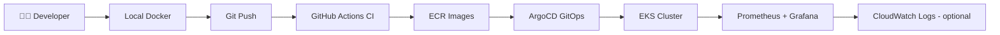
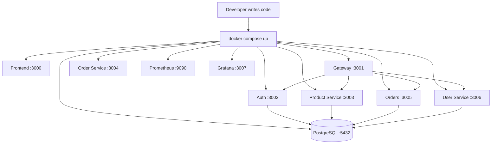
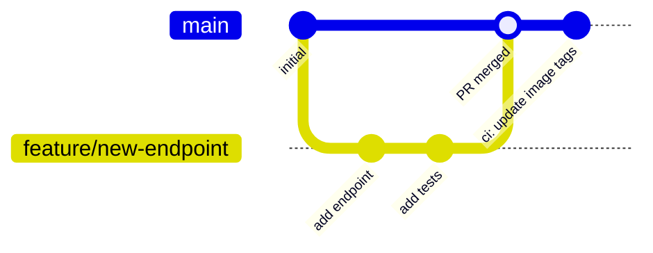
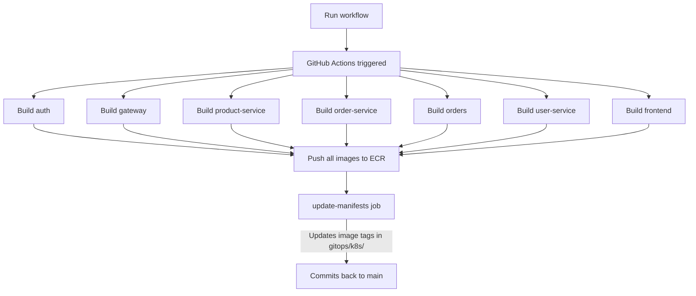
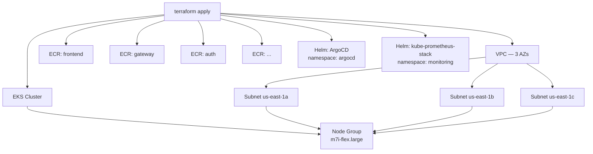
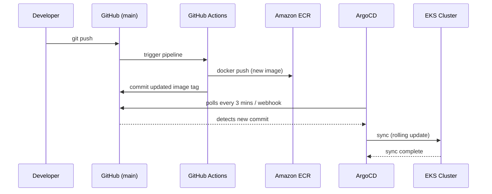
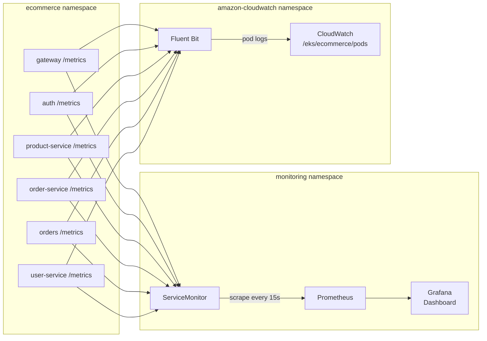
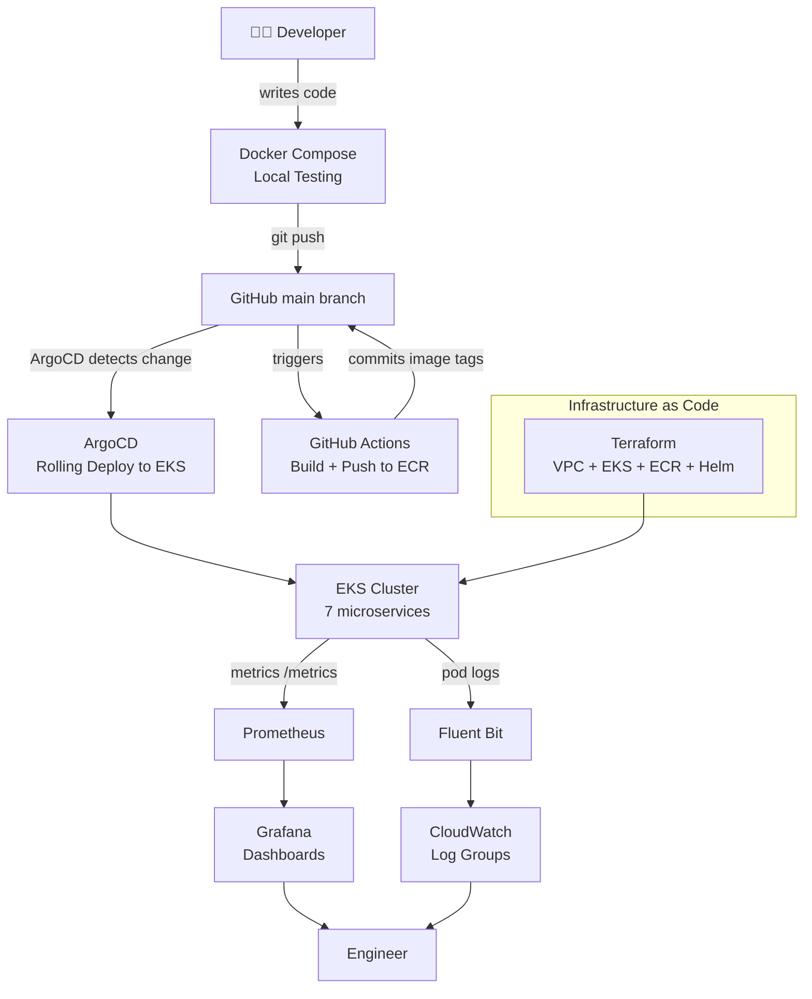

# Delivery Workflow

---

## Overview

How a change moves from a developer's machine to the EKS cluster, and how it is observed once it runs.

---

## Stage 1: Local Development

Every change starts on a developer's machine. The full application stack runs locally using Docker Compose — no cloud account required.

Each service has its own `Dockerfile`. Docker Compose wires them together on a shared network, so the full system can be tested locally before touching any cloud infrastructure. The frontend container serves `./frontend/build` with nginx, so run `npm --prefix frontend run build` first. The gateway proxies four prefixes; `order-service` runs standalone and is not routed by the gateway.

**What to verify locally:**
- All containers show `Up` in `docker ps`
- Frontend loads at http://localhost:3000
- `/api/products` returns data via the gateway
- Prometheus scrapes metrics from `/metrics` endpoints
- Grafana dashboards show live data

---

## Stage 2: Source Control

Once a change is tested locally, it goes into Git.

**The flow:**
1. Developer creates a feature branch
2. Makes changes, commits with clear messages
3. Opens a Pull Request on GitHub
4. PR is reviewed and merged into `main`
5. Run the CI pipeline from the Actions tab (the workflow is manual; it can be switched to run on every push to `main`)

Everything is tracked — who changed what, when, and why. This is the foundation of GitOps.

---

## Stage 3: CI Pipeline — GitHub Actions

When the workflow runs, GitHub Actions builds Docker images for all 7 services in parallel and pushes them to Amazon ECR. The trigger is `workflow_dispatch` (manual); `on: push: branches: [main]` makes it run on every push.

**Key concepts:**
- Each service is a separate matrix job — they all build in parallel
- Images are tagged with the commit SHA for full traceability
- The `update-manifests` job patches the image tag in every Kubernetes manifest and commits the change back
- Argo CD detects this commit; with the manual sync policy you then press Sync to roll it out

**Where to check:** GitHub repo → **Actions** tab → **E-Commerce CI Pipeline**

---

## Stage 4: Infrastructure — Terraform on AWS

Before the cluster can run anything, the infrastructure must exist. The Terraform in [E-Commerce-Infrastructure](https://github.com/hamzashah14/E-Commerce-Infrastructure) provisions everything from scratch.

Terraform also installs ArgoCD and the Prometheus/Grafana stack into the cluster via Helm — so the entire platform is ready to receive workloads the moment `terraform apply` finishes.

---

## Stage 5: GitOps Deployment — ArgoCD

Argo CD runs inside the cluster and watches the `main` branch. When the CI pipeline commits updated image tags back to Git, Argo CD detects the change and, once synced, rolls out the new version.

**What ArgoCD does:**
- Continuously compares the desired state in Git against the live state in the cluster
- If they differ, it syncs — applying only what changed
- With `selfHeal` enabled, a manual change in the cluster is reverted to match Git (the sync policy in this repo is manual)
- Every deployment is auditable — it's just a Git commit

**Key files:**
- `gitops/argo-cd.yml` — registers the repo and branch with ArgoCD
- `gitops/kustomization.yml` — lists all Kubernetes resources to apply
- `gitops/k8s/` — all service deployments, services, database, secrets

---

## Stage 6: Observability

Once the application is running in EKS, three layers of observability keep watch.

**Metrics — Prometheus + Grafana**
- Every backend service exposes a `/metrics` endpoint using `prom-client`
- A `ServiceMonitor` resource tells the Prometheus Operator which Services to scrape; the one in this repo targets the gateway
- Grafana is pre-loaded with the **E-Commerce Microservices** dashboard via a ConfigMap labelled `grafana_dashboard: "1"`; the Grafana sidecar imports it automatically

**Logs — Fluent Bit + CloudWatch**
- Optional, installed with Helm (see the deployment guide): Fluent Bit runs as a DaemonSet in `amazon-cloudwatch`
- Captures stdout from every pod and ships logs to CloudWatch
- Log group: `/eks/ecommerce/pods`

**What to check in Grafana:**
- Request rate by service
- p95 / p99 response times
- 4xx and 5xx error rates
- Pod CPU and memory usage
- Pod restart count — surfaces crash loops early

---

## The Complete Picture

---

## Key Files Reference

| File | Stage | Purpose |
|------|-------|---------|
| `docker-compose.yml` | Stage 1 | Local stack |
| `.github/workflows/ci.yml` | Stage 3 | Build and push images |
| [E-Commerce-Infrastructure](https://github.com/hamzashah14/E-Commerce-Infrastructure) | Stage 4 | Terraform for AWS (separate repository) |
| `gitops/argo-cd.yml` | Stage 5 | ArgoCD application definition |
| `gitops/k8s/` | Stage 5 | All Kubernetes manifests |
| `gitops/k8s/backend/service-monitor.yml` | Stage 6 | Prometheus scrape config |
| `gitops/k8s/grafana-dashboard.yml` | Stage 6 | Pre-loaded Grafana dashboard |
